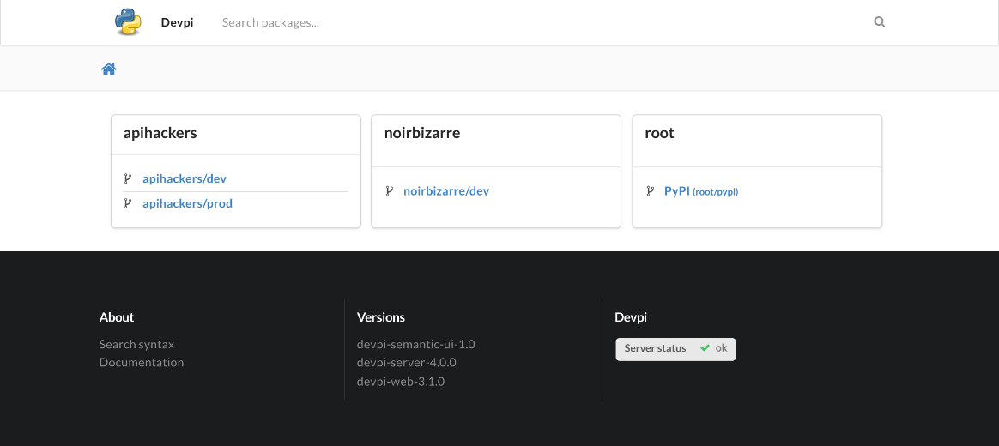
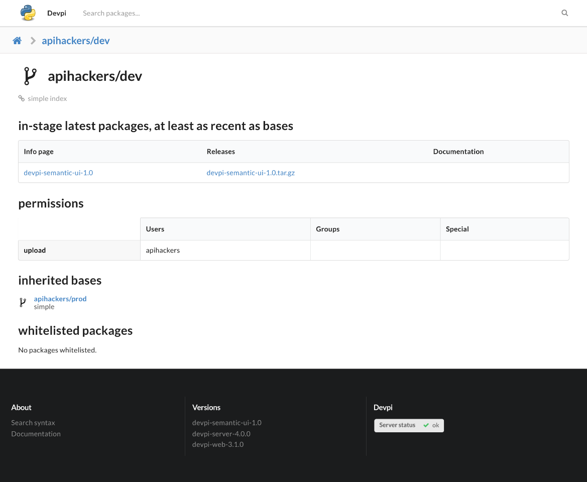

Devpi Semantic UI
#################

A Semantic UI theme for devpi

Installation
============

You can install the theme with pip:

```command
pip install devpi-semantic-ui
```

Usage
=====

Run devpi server with:

```command
devpi-server --theme semantic-ui
```

Screenshots
===========





